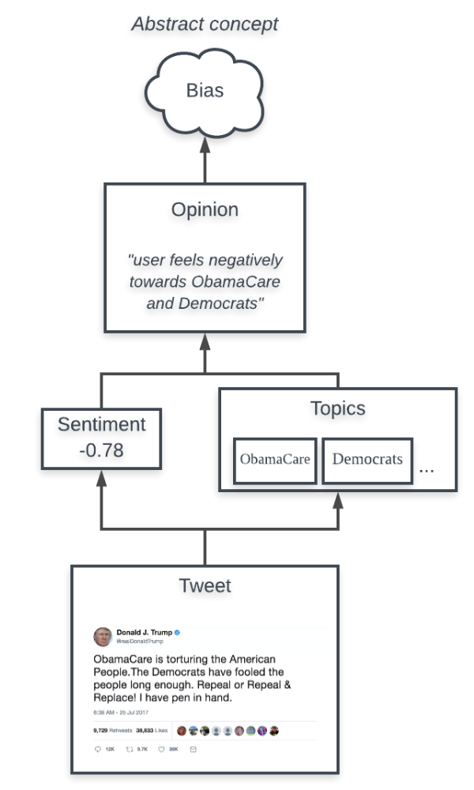
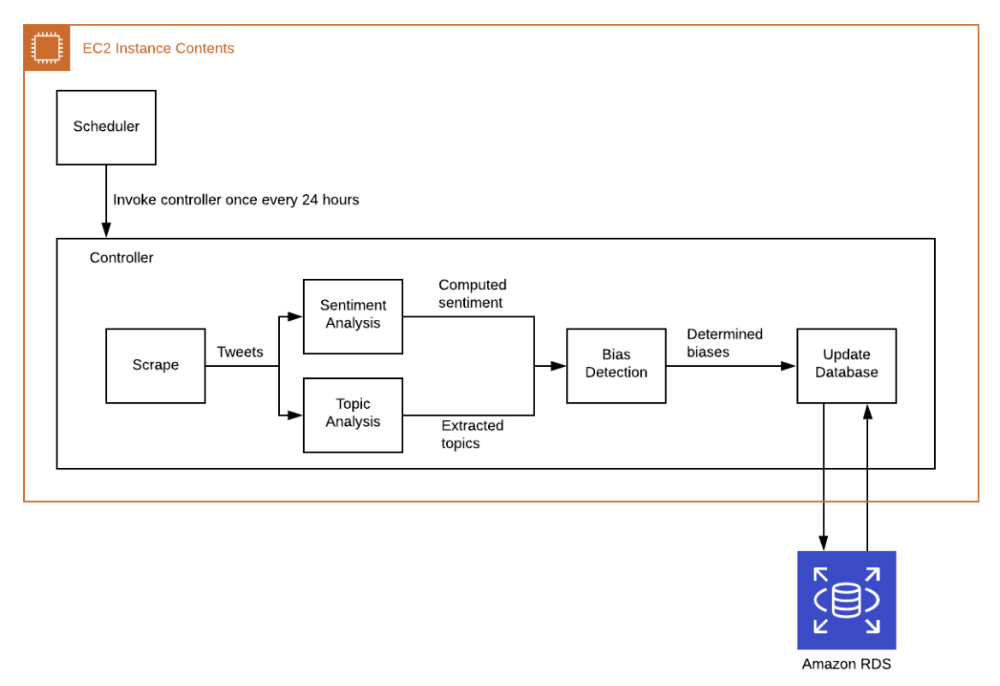

# Twitter-Bias-Detection
A Twitter bias detection and analysis framework.

## Bias Intuition

## Project Architecture

## Installation

## Contents
* scraper: directory containing all scripts/code for scraping Twitter.
    * main.py: main Python script to scrape Twitter via username (using BeautifulSoup).
    * utils.py: Python script containing all helper functions for scraping.

## Usage
`pip3 install -r requirements.txt`

`python3 src/pipeline.py -c config.yaml -a USERNAME_TO_SCRAPE`

(optional arguments excluded)
